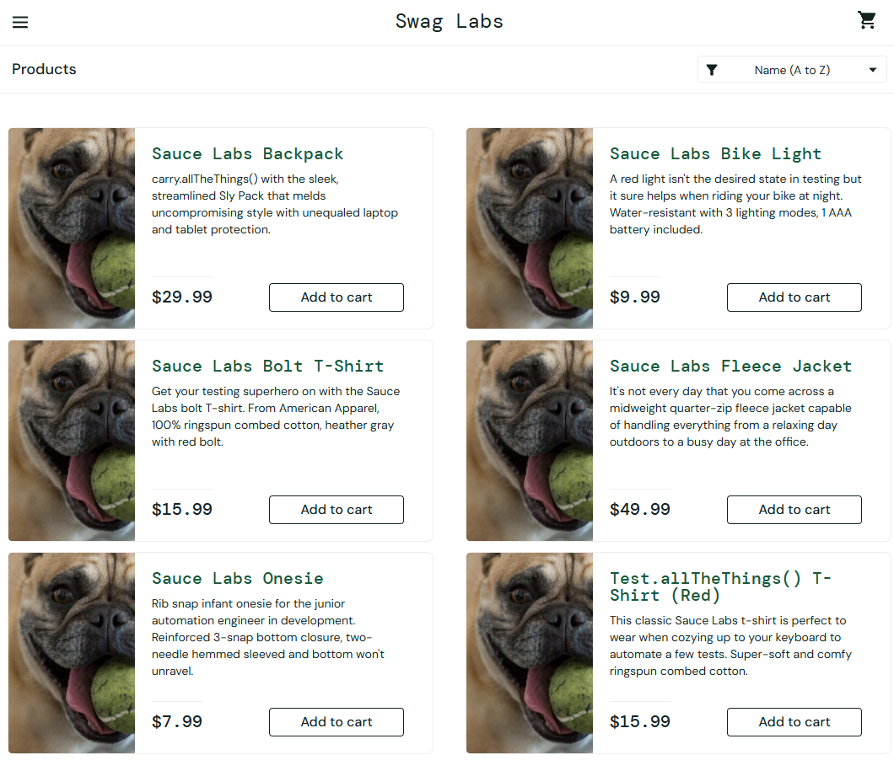

# Bug Reports – [Sauce Demo](https://www.saucedemo.com/)

- **Testing Date**: 20-11-25
- **Tester**: Afope Matilukuro
- **Bugs Documented**: 3

## BUG-001: Login Fails When Valid Credentials Include Extra Whitespace

**Severity**: Medium, **Priority**: P3, **Status**: Open

**Environment**:

- Browser: Brave 1.84.141
- Operating System: Windows 11
- Device type: Desktop
- Test Account: standard_user

**Preconditions**:

- User is on **[Home Page](https://www.saucedemo.com/)**
- User is **not logged in**

**Steps to Reproduce**:

1. Enter **valid username** in the Username field
2. Add an extra space after the username
3. Enter **valid password** in the Password field
4. Click the **Login** button

**Expected Result**:

- Whitespace in the username field is **trimmed**
- User is redirected to
  **[Inventory Page](https://www.saucedemo.com/inventory.html)**
- Product list is displayed

**Actual Result**:

- User remains on **[Home Page](https://www.saucedemo.com/)**
- Username and password field remain the same
- System displays error message:**"Epic sadface: Username and password do not match any user in this service"**

**Evidence**:

## BUG-002: Inventory Items Show Wrong Product Details

**Severity**: Medium, **Priority**: P2, **Status**: Open

**Environment**:

- Browser: Brave 1.84.141
- Operating System: Windows 11
- Device type: Desktop
- Test Account: problem_user

**Preconditions**:

- User is **logged in**
- User is on **[Inventory Page](https://www.saucedemo.com/inventory.html)**

**Steps to Reproduce**:

1. Scroll through the full inventory list
2. Verify that each item’s **name**, **description**, and **image** match
   expected values

**Expected Result**:

- All item names, descriptions, and images display correct and matching details

**Actual Result**:

- All item images are incorrect
- Some item names and descriptions are incorrect

**Evidence**:

## BUG-003: Sort Products by Name (Z → A) Does Not Work

**Severity**: Low, **Priority**: P3, **Status**: Open

**Environment**:

- Browser: Brave 1.84.141
- Operating System: Windows 11
- Device type: Desktop
- Test Account: problem_user

**Preconditions**:

- User is **logged in**
- User is on **[Inventory Page](https://www.saucedemo.com/inventory.html)**

**Steps to Reproduce**:

1. Click the **“Sort”** icon/button
2. Select **“Name (Z - A)”** from the options

**Expected Result**:

- Products reorder in **descending alphabetical order** by name

**Actual Result**:

- All products remain in the same position, nothing changes

**Evidence**:
